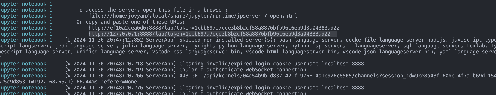

# Wine Quality Prediction 

## Project Board

- [Milestone 1](<https://github.com/orgs/UBC-MDS/projects/177/views/1>)
- [Milestone 2](https://github.com/orgs/UBC-MDS/projects/183)
- [Milestone 3](https://pages.github.ubc.ca/mds-2024-25/DSCI_522_dsci-workflows_students/release/milestone3/milestone3.html)

# Summary
This project explores the relationship between physicochemical properties of wines and their quality ratings, aiming to predict wine quality and identify key factors influencing it using machine learning models such as Decision Trees. Through exploratory data analysis (EDA), we examine patterns, distributions, and correlations, addressing challenges such as class imbalances in wine quality ratings. The Decision Tree model is evaluated using metrics like accuracy, precision, recall, and feature importance to uncover significant predictors, such as density, alcohol, and volatile_acidity. The primary goal is to build an interpretable machine learning pipeline that provides actionable insights for winemakers to optimize production processes and for consumers to make informed choices. Additionally, the project sets the foundation for future work, including incorporating sensory attributes, addressing dataset imbalances, and leveraging more advanced ensemble methods for better predictions.

## Contributors:
- Chukwunonso Ebele-Muolokwu 
- Samuel Adetsi 
- Shashank Hosahalli Shivamurthy
- Ci Xu  

## Reproducible Computational Environment

This project ensures a reproducible computational environment using Conda. Follow the steps below to set up the environment for this project.

### Prerequisites

1. Install Miniconda or Anaconda.
2. Clone this repository:

```bash
git clone https://github.com/UBC-MDS/522-wine-quality-32.git
cd 522-wine-quality-32
```

## Setting Up the Environment

### Option 1: Using `environment.yaml`

This is the recommended method to set up the environment.

1. Create the Conda environment:

```bash
conda env create -f environment.yml
```

2. Activate the environment:

```bash
conda activate 522_milestone_env
```

3. Verify the environment setup:

```bash
python -c "import pandas as pd; print('Environment set up successfully!')"
```

### Option 2: Using Platform-Specific Lock Files

If you want to ensure reproducibility across different operating systems, use platform-specific lock files.

1. Install `conda-lock`:

```bash
pip install conda-lock
```

2. Create the environment using the lock file for your platform:
   - **For Linux/macOS/Windows:**

```bash
conda-lock install --name 522_milestone_env conda-lock.yml
```

3. Activate the environment:

```bash
conda activate 522_milestone_env
```

### Option 3: Using Docker Container
### Running the analysis

1. Navigate to the root of this project on your computer using the
   command line and enter the following command:

```bash
docker compose up
```

2. In the terminal, look for a URL that starts with 
`http://127.0.0.1:8888/lab?token=` 
(for an example, see the highlighted text in the terminal below). 
Copy and paste that URL into your browser.



3. To run the analysis,
open `analysis.ipynb` in Jupyter Lab you just launched
and under the "Kernel" menu click "Restart Kernel and Run All Cells...".

## Pipeline Steps

Each pipeline step is defined in the `Makefile`. Below are the individual targets and how to use them:

### 1. Download Dataset
Download the raw wine quality dataset:
```bash
make data
```

- `Output`: data/raw/wine_data.csv


### 2. Process and Validate Data
Process the raw data and generate the processed training and testing datasets, along with a validation report:
```bash
make process
```

- `Inputs`: data/raw/wine_data.csv
- `Outputs`:
	- data/processed/wine_train.csv
	- data/processed/wine_test.csv
	- report/validation_report.html

### 3. Train the Model

Train a Decision Tree model on the processed data:
```bash
make train
```

  - `Inputs`:
	  - data/processed/wine_train.csv
	  - data/processed/wine_test.csv
	- `Output`: data/model/wine_model.pkl

### 4. Generate Plots
Create visualizations for feature importance and wine quality distribution:

```bash
make plot
```
  - `Inputs`:
	  - data/model/wine_model.pkl
	  - data/processed/wine_train.csv
	  - data/processed/wine_test.csv
	- `Outputs`:
	  - data/img/feature_importance.png
	  - data/img/quality_distribution.png

### 5. Generate the Final Report

Render the analysis report using Quarto:

```bash
make report
```

  - `Inputs`:
	  - data/img/feature_importance.png
	  - data/img/quality_distribution.png
	  - report/wine_quality_eda.qmd
	- `Output`: report/wine_quality_eda.html

### 6. Run the Entire Pipeline

Run all steps in the pipeline:

```bash
make all
```
This command ensures that all intermediate files are created and up to date.

### 7. Clean Up Generated Files

Remove all generated files to reset the pipeline:

```bash
make clean
```

### 8. Retrain and Regenerate Everything

Clean the pipeline and rerun all steps:

```bash
make retrain
```

## Updating the Environment

If you add new dependencies:
1. Update environment.yaml.
2. Rebuild the environment:

```bash
conda env update -f environment.yaml --prune
```
3. For Docker, rebuild the container:

```bash
docker compose build
```

## Cleaning Up


- Remove the Conda Environment:
```bash
conda env remove -n 522_milestone_env
```

- Remove Docker Resources:
```bash
docker compose down --remove-orphans
```